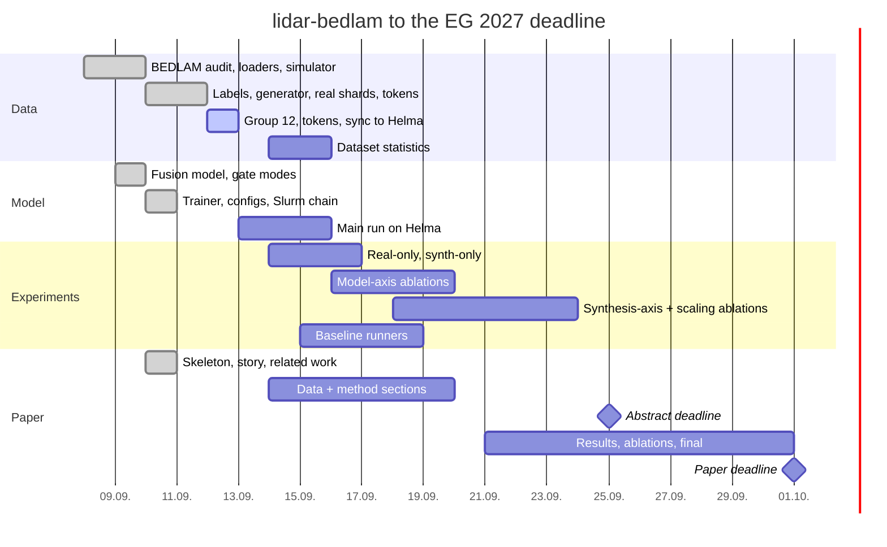

# lidar-bedlam — progress

Single source of truth: timetable at the top, log in the middle, todos at
the bottom. All three use the same sections: **Data**, **Model**,
**Experiments**, **Paper**, **Housekeeping**. Log entries are newest first
within a section and carry the commit that made them.

Target: Eurographics 2027 full paper (abstract 25 Sep 2026, paper 1 Oct
2026, double-blind, 10 pages). Claim and run ladder: `story.md`.

# Timetable

# Log

## Data

### 2026-09-13 — 3DPW shards final, both new ablations queued
3,444 frames -> 4,468 records in 12 shards (`meshlidar/v1`), tokens
computed, copied to Helma; `ablation-3dpw` (job 847706) and
`ablation-pseudo-waymo` (847660) queued. Notebook executed with 34 cells
and 0 errors; sections 10 and 11 render (figures live inside the
re-roll Output widgets). Detached runs must use `.venv/bin/python`:
`uv run` exits 120 without a terminal.

### 2026-09-13 — 3DPW images are numbered by index, not by video id
The first 3DPW pass paired labels with `image_<img_frame_ids[i]>.jpg`;
those ids are 60 Hz video ids (2i), so half the frames were missing and
the other half paired with the wrong image. Images are numbered by the
sequence index (as in the SPIN loader); shards regenerated.

### 2026-09-13 — pseudo-GT SMPL for Waymo and mesh-LiDAR samples from 3DPW
Two new data sources for later ablations. (1) `generate/pseudo_smpl.py` +
`scripts/pseudo_smpl_waymo.py`: SMPL fitted per Waymo training record,
initialised by `main-mixed-000`, optimised on the 13 shared keypoints,
the 2D keypoints and the LiDAR returns (pulled to 3 cm outside the mesh),
with a pose prior on the init; accepted when the keypoint error is below
8 cm; written as `real/v1_pseudo` (keypoints stay the joint labels,
`has_smpl=True` on accepted fits). First shards: 100 % accepted, keypoint
error 105 -> 21 mm. (2) `data/threedpw.py` (world-to-camera verified
against `poses2d`, gendered SMPL), `lidar/mesh_depth.py` (z-buffer
rasteriser, vertices pushed 1-4 cm along their normals = clothing),
`generate/mesh_synth.py` (same scan plan and record builder as BEDLAM,
`dataset="3dpw"`), `scripts/generate_3dpw.py`; returns sit 3.0 cm from
the skin mesh (median). Configs `ablation_pseudo_waymo.yaml`,
`ablation_3dpw.yaml`. Notebook sections 10 and 11 (seeded re-roll
buttons). Trainer now writes an evaluation figure per source and step
(`outputs/<run>/vis/`), mirrored to wandb as images. 3 tests.

### 2026-09-12 — person masks now include the hair
BEDLAM ships a `hair` mask part in the `*handhair*` groups; the loader
unioned only `body` and `clothing`, so long-haired heads were cut and
their LiDAR returns dropped (found on
`20221024…handhair…/seq_000099/0075/00`). `PERSON_MASK_PARTS` gained
`hair` (1 test); notebook cell 1b shows old vs new mask and the returns on
the hair for that sample (+395 mask pixels, +5 returns at OS1-128).
Group 01 (the only hair group, 10,101 records) regenerated as `synth/v1`
(old copy `synth/v1_nohair`), tokens recomputed, to be copied to Helma.

### 2026-09-12 — repo mapped onto the fixed project structure
`.docs/` (progress, figures, latex-draft, runs), `lidar_bedlam/slurm/`, `outputs/` for
runs, `config-global.json` + `lidar_bedlam/scripts/dm_link.py` replacing
`link_data.sh`; `PROJECT.md` and `CHANGELOG.md` merged into this file.

### 2026-09-12 — synthetic pool complete
Groups 02-11: 304,930 records in 601 shards (tokens done, syncing to
Helma); group 12: 75,342 records in 156 shards (tokens computing). With
group 01 (10,101) the pool is 390,373 records, 85x the Waymo train count.
Body models, group 01 and all real shards (85 GB) already on Helma.

### 2026-09-10 10:46 — BEDLAM frames without depth are skipped (dc8a628)
`BedlamFramesSource` indexes only frames whose png and depth exist
(`incomplete` counter); the notebook failed on the group whose extraction
was still running. 1 test.

### 2026-09-10 09:16 — fixes found at scale (1429370)
Per-frame mask lookup ignored the group; SLOPER4D seq009 stores 4 values
per 2D joint; bash `GROUPS` is reserved. Waymo shards: 4,591 train / 894
val records; SLOPER4D train 21,062 records.

### 2026-09-10 03:28 — real shards, shard dataset, SAM 3 masks, tokens (b3bf5eb)
`lidar_bedlam/scripts/sam3_waymo_masks.py` (5,560 Waymo crops, verified visually),
`generate/real.py`, `data/shards.py` (`ShardDataset`: scan-variant
selection, precomputed tokens, point augmentation),
`lidar_bedlam/scripts/precompute_tokens.py` (frozen ViT-H tokens, fp16).

### 2026-09-10 03:19 — synthetic shard generator (926e3a5)
`generate/records.py` (fixed-shape records, npz shards with named scan
variants), `lidar/placement.py` (ball placement, rig poses),
`lidar/distance.py` (virtual distance by moving the camera back with
z-buffer re-rendering; the first attempt scaled the scene, which keeps
angles and was wrong), `generate/synth.py` (8 scan variants per frame,
visibility rule 90x35 px + 30 returns, augmented copy, distance
augmentation on 30 % of frames), multiprocess CLI. 5 tests.

### 2026-09-10 03:10 — BEDLAM SMPL labels attached (d54a96a)
`data/bedlam_labels.py`: translation = `trans_cam + cam_ext[:3,3]`
(verified: 85 % of vertices inside the masks); silhouette-overlap matching
(98 % of labels matched). Extraction queue for the 11 remaining groups.

### 2026-09-10 00:55 — sensor rigs and rolling shutter (d46f545)
`rigs/`: Waymo, nuScenes, SLOPER4D, AVA, FUSE-Bike loaders, plotly
figures, exports (PNG, HTML, GLB, tree) into `figures/rigs/`;
`lidar/motion.py`: `SpeedSetting` (10 km/h steps, Waymo preset 20 +- 20
km/h) and `apply_rolling_shutter`.

### 2026-09-09 22:35 — augmentations (e42366f)
`lidar/augment.py` (cover, channel dropout, jitter, outliers,
miscalibration), `data/image_augment.py` (erasing, cover, colour, blur,
JPEG, bbox jitter); notebook section with the 4x3 resolution grid.

### 2026-09-09 17:42 — Ouster presets (70fdc89)
OS0/OS1/OS2 families by channels x steps per revolution; `azimuth_window`
maps the camera HFOV to scan columns.

### 2026-09-09 10:32 — LiDAR simulator (67b3a2f)
Ray marching against the BEDLAM depth, sensor offsets, noise, dropout,
occlusion augmentation. SMPL labels located on the project server
(42a917c).

### 2026-09-08 18:26 — data pipeline (2c8706c)
Loaders for SLOPER4D, LiDARHuman26M, Waymo (pose_complete_4) and BEDLAM
raw frames on one camera-frame schema; torch dataset; losses; metrics; 21
tests. BEDLAM v1 verified complete (390 archives, 6.54 TB, planar z-depth
in cm); BEDLAM 2.0 skipped.

## Model

### 2026-09-12 — Waymo keypoints were supervising the wrong joints
`mix80-000` reached 57 mm MPJPE on SLOPER4D but 370 mm on Waymo while
`synth-only-000`, which never saw Waymo, got 103 mm there: the joint and
2D-keypoint losses compared Waymo's 15 keypoints index-by-index with the
24 SMPL joints. Fix: the batch carries `joint_convention_id`, the model
regresses COCO-17 joints from the mesh (`joints_coco`, `kp2d_coco` via
`J_regressor_coco.npy`), and the losses compare waymo15 rows to the 13
shared COCO joints (`WAYMO15_TO_COCO17` now in `data/schema.py`), as the
evaluation protocol already did. 1 test; 30-step smoke on the Waymo
mixture. `mix80` must be rerun; `synth-only-000` is unaffected.

### 2026-09-12 — epochs and live wandb mirror
`optim.max_epochs` (epoch = one pass over all training records, ~416k;
main runs 50, ablations 17; `max_steps` derived), `train/epoch` logged and
used as the x axis. Compute nodes have no proxy, and `wandb sync` cannot
read a live offline run, so the trainer now writes `metrics.jsonl` +
`config.json` per run and `lidar_bedlam/scripts/wandb_mirror.py` (login node, every 2
min) pushes new rows to wandb under the run's name; verified end to end
with `smoke-mirror-000`. The two runs started before this change
(`mix80-000`, `synth-only-000`, 12k steps = 59 epochs) sync at their end.

### 2026-09-12 — batch-size tests done, full runs at batch 2048
Round 2 (memmap loader, node-local staging, 4x H100, 600 steps each):

| batch | samples/s | peak GiB/GPU |
|---|---|---|
| 256 | 3,200 | 2.3 |
| 512 | 4,500 | 4.0 |
| 1024 | 5,200 | 7.2 |
| 2048 | 5,600 | 13.7 |

Throughput is flat above 1024 (loader-bound with 64 workers), memory far
from the 80 GiB. Chosen: batch 2048, lr 3e-4, 12k steps (24.6 M samples,
about 1.5 h per run) for `mix80` (80/10/10) and `synth_only` (100 %
BEDLAM); eval every 500 steps. Runs of the tests are on wandb
(`batchtest2-b<N>`).

### 2026-09-12 — loader was the bottleneck: memory-mapped shards (f83d95d)
First batch tests on Helma: 360-390 samples/s at batch 256 and 512 with
only 2.3 / 4.0 GiB peak per GPU, i.e. the GPUs waited for data. Cause:
`np.load` on an npz re-reads a whole member (96 MB image stack) on every
row access. `Shard` now maps the uncompressed members in place (zip local
headers parsed, `np.ndarray` views on one memmap), rows are copied only
where they become tensors; 28 ms/sample warm, 1 test. Jobs now use 64
CPUs, 16 workers per rank and stage only the needed shard directories to
node-local `/tmp` (`STAGE_DIRS`). Round 2 of the tests: `batchtest2-b<N>`.
First test also validated the whole chain: eval, `best.pt`, `DONE`, wandb
sync from the login node (run visible in wandb).

### 2026-09-12 — batch-size scaling tests submitted on Helma (1bba8d2, 7fdeb54)
`configs/batchtest.yaml` (80/10/10 mixture on group 01 + real shards,
600 steps) at batch 256 / 512 / 1024 / 2048, 1 h each, h100 partition,
run names `batchtest-b<N>`; trainer logs samples/s and peak GPU memory;
wandb login on the Helma login node with `lidar_bedlam/slurm/wandb_sync_loop.sh`
detached there. Requested runs afterwards: `configs/mix80.yaml` (80 %
BEDLAM, 10 % SLOPER4D, 10 % Waymo) and `configs/synth_only.yaml` (100 %
BEDLAM) at the largest batch that fits.

### 2026-09-10 09:41 — training stack (5e51d6f)
`train/config.py` (YAML + overrides, `${DATA_ROOT}`), `train/sampler.py`
(fixed per-batch mixture, DDP-sharded), `train/loop.py` (torchrun DDP,
AdamW + warm-up/cosine, bf16, eval every N steps, `last.pt`/`best.pt`,
auto-resume, SIGUSR1 checkpoint-and-exit, `DONE`, offline wandb),
`metrics/protocol.py`, gate modes `learned|none|hard|image_only|lidar_only`,
IoU-confidence head, `main.py`, `evaluate.py` (now `lidar_bedlam/scripts/lidar-bedlam-{main,eval}.py`), 16 configs,
`lidar_bedlam/slurm/train.sbatch` (self-resubmitting), `lidar_bedlam/slurm/wandb_sync.sh`. SMPL heads
forced to float32 under autocast. Smoke run: 40 steps on the 4090. 5 tests
(68 total). Helma: `/anvme` and `$WORK` not on compute nodes,
`/hnvme/workspace` is (`cluster.md`).

### 2026-09-09 11:13 — selective-attention fusion model (8846d44)
ViT with TokenHMR ViT-H weights (0 missing keys), point tokenizer, gated
dual cross-attention decoder with routing priors, SMPL heads (6D
rotations, translation via crop intrinsics), differentiable SMPL, 3D box;
`notebooks/capabilities.ipynb`.

## Experiments

### 2026-09-14 — image baselines scored with our protocol (TokenHMR, HMR2, CameraHMR)

Runners in `lidar_bedlam/scripts/baselines/` execute each published model
in its own conda env on exactly our evaluation records (the 256 px crops
of `real/v1`, `waymo_val` 894 and `sloper4d_test` 9,904) and write
camera-frame meshes; `lidar_bedlam/scripts/score_baselines.py` then derives
SMPL/COCO joints and the 3D box the same way as for our model and runs
`metrics/protocol.py` unchanged (translation = SMPL transl parameter, box
confidence 1). Weak-perspective cameras are converted to metric
translation with the crop's true intrinsics (HMR2's `cam_crop_to_full`
with the real principal point); CameraHMR gets the intrinsics as input
instead of estimating them.

- Environments: `4D-humans` conda env for all three image methods (numpy
  pinned < 2 so torch 2.2 initialises; `flatten_dict` added for TokenHMR);
  HMR2 from `~/Documents/4D-Humans` (`~/.cache/4DHumans` weights, epoch 35),
  TokenHMR from `~/Documents/tokenHMR` (that checkout hardcodes a NAS
  checkpoint path in `lib/utils/misc.py`, the runner swaps in the identical
  local file), CameraHMR from `third_party/CameraHMR` with `data/` symlinks
  to our SMPL, the mean params and `~/Downloads/camerahmr_checkpoint_cleaned.ckpt`.
- Inference cost is negligible: ~115 crops/s per ViT-H method on the 4090
  (8 s for Waymo val, ~90-170 s for SLOPER4D test); the whole pass over
  10.8k crops takes ~3 min per method, scoring ~2 min. The work was the
  adapters and environments (~4 h).
- Two input variants: `full` = our 256 px crop as is (same pixels our model
  sees), `tight` = HMR2-style square re-crop around the labelled joints.
  They agree within 1 mm and 0.02 mAP, so `full` is the protocol.

| method (full crop) | W MPJPE | W PA | W transl | W mAP | S MPJPE | S PA | S transl | S mAP |
|---|---|---|---|---|---|---|---|---|
| HMR2.0 (4D Humans) | 104.4 | 69.8 | 1.34 m | 0.016 | 91.3 | 70.8 | 0.121 m | 0.40 |
| TokenHMR (tight crop) | 98.5 | 66.3 | 1.15 m | 0.024 | 74.5 | 54.8 | 0.204 m | 0.26 |
| CameraHMR (GT intrinsics) | 76.9 | 60.0 | 1.02 m | 0.029 | 51.6 | 44.4 | 0.196 m | 0.40 |
| ours main-mixed (10.2k steps, S on first 4,000) | 92.6 | 75.6 | 0.52 m | 0.44 | 55.7 | 45.5 | 0.08 m | 0.83 |

SLOPER4D on the full test set (9,904) vs the trainer's first 4,000: MPJPE
differs by up to 9 mm for HMR2/TokenHMR (82 vs 91, 66 vs 75), CameraHMR is
stable (51.7 vs 51.6); `outputs/baselines/results_4000.json` holds the
subset numbers, `results_full.json` the full ones.

Reading: HMR2 on Waymo reproduces the 106 mm reported for the same weights
in the LiDAR-HMR checkpoint notes, so the pipeline is sound. Image-only
methods are at 1.0-1.3 m placement error on Waymo (0.12-0.20 m on the
near-range SLOPER4D) and 0.02-0.03 box mAP; our fusion model is 2x closer
on Waymo, 2.5x on SLOPER4D and 0.44 / 0.83 mAP. On pose, CameraHMR is the
strongest baseline and beats our current checkpoints (Waymo 76.9 vs 92.6
mm, SLOPER4D 51.6 vs 55.7 mm); TokenHMR, whose frozen ViT-H tokens we use,
is close to us on Waymo (98.5 vs 92.6) and behind on SLOPER4D (74.5 vs
55.7). The paper claim therefore rests on placement and detection quality,
not on pose accuracy; the final 20 h runs decide the pose column.

Open: LiDAR-HMR (Waymo release weights) runs in a new `lidar-hmr` conda env
(torch 2.2 cu121, PyG wheels, `pointops` from PointTransformerV2 and the
vendored `pointnet2_ops` compiled with `TORCH_CUDA_ARCH_LIST=8.9`, chumpy
patched for numpy 1.26, a pytorch3d shim); the runner is written and the
model loads, the 492 MB checkpoint is still copying from the slow NAS to
`resources/pretrained-checkpoints/lidar-hmr/`. Local, untracked setup in
the submodules: `third_party/CameraHMR/data/` symlinks,
`third_party/LiDAR-HMR/smplx_models/smpl/SMPL_NEUTRAL.pkl` symlink and the
`pointnet2_ops_lib/setup.py` arch list.

### 2026-09-14 — final-schedule runs submitted (6 x ~20 h)
`configs/full_*.yaml`: 150,000 steps at batch 2048 (about 20 h incl.
evaluations every 2,000 steps on the full SLOPER4D test set of 9,904 and
Waymo val), checkpoints every 1,000 steps, the chain job resumes past the
24 h wall time; `best.pt` now = highest Waymo box mAP. Jobs 850403-850408:
`full-synth-only`, `full-real-only`, `full-main-mixed`, `full-mix80`,
`full-pseudo-waymo`, `full-3dpw`. These replace the 10.2k/12k-step main
table; the 3,468-step ablations stay as relative comparisons.

### 2026-09-13 — fusion ablations with two seeds; pseudo-GT and 3DPW ablations
50/40/10 mixture, 17 epochs = 3,468 steps; mean +- half-range over seeds
0 and 1 (Helma/wandb names: `abl-<variant>-000` and `abl-<variant>-s1`,
reference `abl-mixed-short-001` / `-s1`):

| variant | W MPJPE | W PA | W transl | W mAP | S MPJPE | S PA | S transl | S mAP |
|---|---|---|---|---|---|---|---|---|
| learned gates (reference) | 108.4+-3.4 | 90.3+-5.1 | 0.509 | 0.467 | 80.2+-1.1 | 59.9+-0.6 | 0.079 | 0.738+-0.015 |
| image only | 118.0+-0.3 | 94.6+-0.5 | 2.232 | 0.002 | 112.6+-6.8 | 78.5+-3.6 | 0.730 | 0.021 |
| LiDAR only | 218.3+-6.1 | 164.0+-1.3 | 0.589 | 0.331 | 144.6+-0.8 | 103.3+-0.5 | 0.068 | 0.635 |
| gate none (plain sum) | 115.7+-2.0 | 94.6+-1.0 | 0.511 | 0.444 | 101.5+-3.5 | 75.8+-1.3 | 0.096 | 0.555+-0.057 |
| gate hard (fixed priors) | 112.0+-1.6 | 93.7+-3.3 | 0.525 | 0.444 | 83.1+-4.3 | 62.2+-0.6 | 0.085 | 0.633+-0.045 |
| + pseudo-GT SMPL on Waymo (1 seed) | 108.5 | 73.4 | 1.443 | 0.167 | 69.5 | 48.4 | 0.065 | 0.717 |
| + 3DPW mesh-LiDAR 10 % (1 seed) | 104.1 | 84.6 | 0.514 | 0.456 | 80.4 | 60.9 | 0.072 | 0.737 |

Reading. With two seeds the fusion ordering is clear on SLOPER4D and on
mAP: learned gates 80 mm / 0.74 vs fixed priors 83 / 0.63 vs plain sum
102 / 0.56; on Waymo pose the three are within 4-8 mm (learned best).
Image only cannot place (2.2 m), LiDAR only cannot pose (218 mm).
3DPW records give a small Waymo pose gain (104 vs 108 mm) at equal
placement. Pseudo-GT Waymo labels give the best pose of every short run
(Waymo PA 73 vs 90 mm; SLOPER4D 69.5 / 48.4 mm) but Waymo placement is
far worse (1.44 m, mAP 0.17) and still falling at the end of the run;
on its own training shard the checkpoint is 0.85 m off the fitted
translations while the fitted translations themselves sit at the
keypoint hip centre, so the labels are consistent and the run is not
converged on placement (the direct translation loss on 40 % of every
batch starts at about 2.5 m). Candidates: longer schedule or a lower
translation weight for pseudo rows.

### 2026-09-13 — state at the machine switch
Helma queue (all pending, partition full): `ablation-{image-only,
lidar-only,gate-none,gate-hard}` seed 0 on 50/40/10, the same four plus
`ablation-mixed-short` as `-s1` (seed 1), `ablation-pseudo-waymo` (job
847660). The login-node mirror loop is running (`WANDB_MIRROR_DIR`).
On mbwm a detached script `outputs/logs/post_3dpw.sh` (log
`post_3dpw.log`) waits for the 3DPW generation, computes the tokens,
copies `meshlidar/v1` to Helma, submits `ablation-3dpw` and re-executes
the notebook. To follow from another machine: `ssh helma squeue -u
$USER`, wandb `erik_hm/lidar-bedlam`, and the Slurm logs in
`outputs/slurm-*.out` on Helma; results as `outputs/<run>/val_*.json`.

### 2026-09-13 — fusion ablations on 50/40/10 and a second seed (9 jobs)
Submitted: the four variants `abl-{image-only,lidar-only,gate-none,gate-hard}`
(seed 0, 50/40/10, vs `abl-mixed-short-001`; on Helma and wandb they carry
the reused name `-000`, since the 80/10/10 folders were deleted before) and seed 1 of the reference and the
four variants (`abl-*-s1`, `EXTRA_SET=seed=1`), jobs 847325-847333.

### 2026-09-13 — scaling curve at fixed compute: flat
50/40/10 mixture, 3,468 steps each, synthetic pool capped at k x the
Waymo train count (18 / 36 / 73 / 145 / 291 shards vs 806 for the
reference):

| synthetic pool | W MPJPE | W PA | W transl | W mAP | S MPJPE | S PA | S transl | S mAP |
|---|---|---|---|---|---|---|---|---|
| 2x (9k records) | 108.8 | 88.4 | 0.523 | 0.436 | 82.5 | 59.9 | 0.101 | 0.705 |
| 4x | 119.7 | 102.2 | 0.517 | 0.440 | 85.2 | 62.8 | 0.092 | 0.651 |
| 8x | 107.3 | 88.4 | 0.520 | 0.449 | 76.8 | 56.8 | 0.101 | 0.678 |
| 16x | 110.8 | 91.5 | 0.520 | 0.435 | 79.6 | 57.0 | 0.087 | 0.721 |
| 32x | 103.0 | 84.0 | 0.501 | 0.482 | 77.8 | 55.9 | 0.107 | 0.669 |
| full (85x, reference) | 111.8 | 95.4 | 0.507 | 0.465 | 81.3 | 59.2 | 0.079 | 0.723 |

Reading: within the noise (about +-5 mm, +-0.03 mAP) the size of the
synthetic pool does not matter at this budget; 9k synthetic records
already give the full effect. The gain comes from the presence and
variety of simulated LiDAR, not from volume, at least at 3.5 M synthetic
samples seen; a longer schedule may separate the curve.

### 2026-09-13 — synthesis axis done; scaling curve rerun at fixed steps
50/40/10 mixture, 17 epochs = 3,468 steps, reference `abl-mixed-short-001`:

| run | W MPJPE | W PA | W transl | W mAP | S MPJPE | S PA | S transl | S mAP |
|---|---|---|---|---|---|---|---|---|
| reference (ball 1 m, 12 resolutions) | 111.8 | 95.4 | 0.507 | 0.465 | 81.3 | 59.2 | 0.079 | 0.723 |
| ball 0.25 m | 105.0 | 85.8 | 0.514 | 0.458 | 72.5 | 52.6 | 0.062 | 0.736 |
| LiDAR at the Waymo rig pose | 103.0 | 84.8 | 0.515 | 0.458 | 79.7 | 59.5 | 0.078 | 0.671 |
| Waymo resolution only | 108.0 | 88.3 | 0.517 | 0.448 | 92.9 | 68.2 | 0.083 | 0.600 |

Reading: the rig-matched pose gives the best Waymo pose but loses on
SLOPER4D mAP (0.67 vs 0.72), the target-only resolution costs SLOPER4D
pose (93 vs 81 mm) without helping Waymo, and the small 0.25 m ball beats
the 1 m ball on both sets. Placement metrics are flat across the axis.
The first scaling runs were invalid: `max_epochs` over a capped pool gave
289-799 steps; the five configs now fix `max_steps: 3468` and were
resubmitted (jobs 845904-845908).

### 2026-09-13 — synthesis axis and scaling curve submitted (9 jobs)
Ablations rebased on the 50/40/10 mixture that won the main table
(`abl-mixed-short-001` as the new reference; the `-000` model-axis runs
were on 80/10/10). Submitted: `ablation-ball025`, `ablation-rig-waymo`,
`ablation-target-waymo`, `ablation-scale-{2,4,8,16,32}x` (jobs
844883-844891), 17 epochs each.

### 2026-09-12 — comparison batch, last validation of every run
Batch 2048, lr 3e-4; main table 10,200 steps (synth-only 12,000);
model-axis ablations 17 epochs = 3,468 steps on the 80/10/10 pool.
W = Waymo val (894), S = SLOPER4D test (4,000); MPJPE / PA in mm,
translation in m, box mAP.

| run | W MPJPE | W PA | W transl | W mAP | S MPJPE | S PA | S transl | S mAP |
|---|---|---|---|---|---|---|---|---|
| synth-only-000 | 99.3 | 72.7 | 1.389 | 0.186 | 72.4 | 51.0 | 0.250 | 0.357 |
| real-only-000 (80/20 W/S) | 90.8 | 71.5 | 0.692 | 0.301 | 66.4 | 53.0 | 0.104 | 0.693 |
| mix80-001 (80/10/10) | 102.4 | 84.9 | 0.520 | 0.476 | 56.4 | 45.0 | 0.068 | 0.785 |
| main-mixed-000 (50/40/10) | 92.6 | 75.6 | 0.518 | 0.436 | 55.7 | 45.5 | 0.057 | 0.828 |
| abl-mixed-short (learned gates) | 126.9 | 103.9 | 0.617 | 0.408 | 74.5 | 52.4 | 0.078 | 0.720 |
| abl-image-only | 153.0 | 117.0 | 2.135 | 0.007 | 103.7 | 66.3 | 0.692 | 0.035 |
| abl-lidar-only | 222.6 | 156.1 | 0.677 | 0.227 | 137.7 | 105.8 | 0.064 | 0.635 |
| abl-gate-none (plain sum) | 123.0 | 96.4 | 0.602 | 0.333 | 83.1 | 63.6 | 0.085 | 0.694 |
| abl-gate-hard (fixed priors) | 132.2 | 107.2 | 0.640 | 0.406 | 80.5 | 60.0 | 0.077 | 0.672 |

Reading: synthetic data buys placement (Waymo translation 0.69 -> 0.52 m,
mAP 0.30 -> 0.44-0.48) and SLOPER4D across the board (66 -> 56 mm, 10 ->
6 cm), but not Waymo pose, where real-only is best (90.8 mm) and the
50/40/10 mixture (92.6) beats 80/10/10 (102.4). Fusion: image-only cannot
place (2.1 m), LiDAR-only cannot pose (223 mm); both gated variants sit
between; plain sum vs learned gates is within noise on pose at 1/3
schedule, learned gates lead on mAP (0.41 vs 0.33).

### 2026-09-12 — mix80-001 (fixed Waymo supervision, corrected shards) finished
10,200 steps (50 epochs), last: Waymo MPJPE 102.4 / PA 84.9 mm, translation
0.52 m, box mAP 0.48; SLOPER4D MPJPE 56.4 / PA 45.0 mm, 6.8 cm, mAP 0.79.
Against `synth-only-000` (99.3 / 72.7 mm, 1.39 m, 0.19 on Waymo): adding
10 % real data cuts the Waymo placement error to 37 % and more than doubles
mAP at equal pose accuracy. Four gate ablations crashed on DDP's unused-
parameter check (gate MLP / one stream has no gradient in those modes);
fixed with `find_unused_parameters` for non-learned gates and resubmitted
(jobs 843895-843898).

### 2026-09-12 — comparison batch submitted (7 jobs)
Schedules made comparable: main-table rows count steps because their
pools differ (`real_only`, `main_mixed` = 10,200 steps at batch 2048, the
compute of `mix80-001`'s 50 epochs); ablations share the 80/10/10 pool and
count epochs (`max_epochs: 17`, one third). Submitted on Helma:
`real-only`, `main-mixed` (50/40/10), `ablation-mixed-short` (reference),
`ablation-image-only`, `ablation-lidar-only`, `ablation-gate-none`,
`ablation-gate-hard` (jobs 843794-843800), alongside `mix80-001`.

### 2026-09-12 — first full runs (12k steps, batch 2048)
`synth-only-000` (100 % BEDLAM, zero-shot on real data), last step:
Waymo MPJPE 99.3 / PA 72.7 mm, translation 1.39 m, box mAP 0.19;
SLOPER4D MPJPE 72.4 / PA 51.0 mm, translation 0.25 m, mAP 0.36.
`mix80-000` (80/10/10, trained with the Waymo keypoint bug): SLOPER4D
MPJPE 52-56 / PA 44 mm, translation 5-7 cm, mAP 0.78-0.89; Waymo
translation 0.73 m and mAP 0.47 but MPJPE 390-405 mm, the symptom that
exposed the bug. Both runs are on wandb. `mix80-001` resubmitted with the
fix and the corrected group-01 shards (job 843483).

### 2026-09-10 02:44 — plan and ablations decided (30c4b90, d46f545)
Waymo headline, SLOPER4D secondary, LiDARHuman26M and PedX dropped;
`plan.md`, `ablations.md` (ball-radius sweep, resolution ablation, rolling
shutter kept as a generation option only).

## Paper

### 2026-09-11 13:38 — related work and bibliography (72af389, fc8943a, 0e3d746)
39 bib entries with venue macros from `latex-draft/bib/bib-short.def`;
related-work bullets; LIF-Net (IV 2026) and BikeActions (ICPR 2026)
official citations. Self-contained build: style files beside `main.tex`
and a `latexmkrc` (8445f2e).

### 2026-09-10 18:10 — contributions and story (3df2902, 41192fa, 09070d4, df39884)
`story.md` (claim, model / data / synthesis ladders, run order); three
contribution bullets; 6.3 extrinsics questions.

## Housekeeping

### 2026-09-13 — Helma file quota hit by wandb run folders
`rsync` to the workspace failed with "Disk quota exceeded": `outputs/`
held 50,127 files, 49,713 of them wandb run directories (about 700 per
mirrored or offline run; the workspace allows 61k files). Removed the
superseded run folders (batch tests, `mix80-000`, the 80/10/10 and the
invalid scaling ablations, all deleted from wandb by the user as well)
and every `outputs/*/wandb`; the mirror now writes its wandb files to
`$HOME/wandb-mirror` (`WANDB_MIRROR_DIR`). 268 files left in `outputs/`.

### 2026-09-12 — final layout, round 2 (top level minimal)
`scripts/` and `slurm/` moved inside the package; `data/` and
`checkpoints/` became `resources/data/` and `resources/pretrained-checkpoints/`
(gitignored, built by `lidar_bedlam/scripts/dm_link.py`); top level is now
`lidar_bedlam/ configs/ notebooks/ tests/ third_party/ .docs/ resources/
outputs/` plus the config files. The `python-project-init` skill was
rewritten to this contract (tree, folder table with tracked/gitignored and
use, steps). On Helma the data folder must be moved to `resources/data`
and the mirror loop restarted after the two running jobs finish.

### 2026-09-12 — preparation finished: final layout before moving to Helma
Flat package `lidar_bedlam/` (no `src/`), `utils/` for io and viz, entry
points `lidar_bedlam/scripts/lidar-bedlam-{main,eval}.py`, `notebooks/` at the top
level, job logs under `outputs/logs/`; ruff excludes `third_party/`,
uv default groups `dev` + `debug`. `HANDOFF.md` carries the `tree -L 2`
and the fixed package structure as the template for new projects. From
here on the work happens on Helma; the wandb hook must be extended to
match `*-main.py`.

### 2026-09-08 18:08 — scaffold (c9beeab)
uv, hatchling, ruff, mypy strict; five baseline submodules; BEDLAM audit;
dataset survey.

# Todos

## Data

- [ ] Data on Helma: `/hnvme/workspace/v103fe17-lidar-bedlam/resources/data/generated` (all 12 groups + real, complete).
- [ ] Dataset statistics for the paper (persons, frames, distance histogram, beams, occlusion levels) and the comparison table.
- [ ] Run the official xxh128 validation on the NAS (`lidar_bedlam/scripts/validate_bedlam_on_nas.sh`).
- [ ] Rolling shutter: apply `SpeedSetting` + `apply_rolling_shutter` in the generator (default speed 0 for v1).
- [ ] Decide on additional rigs (heads-up list in `datasets.md`).
- [ ] Waymo LiDAR-only samples (5,006) as `has_image=False` records (after the main run).

## Model

- [ ] Pending on Helma (AssocGrpGRES): six final-schedule runs (~20 h). Baselines TokenHMR / HMR2 / CameraHMR scored (see 2026-09-14); LiDAR-HMR next, then the paper tables. (`sbatch --export=ALL,CONFIG=configs/main_mixed.yaml lidar_bedlam/slurm/train.sbatch`); verify the resume chain at the first wall-time hit; sync wandb from the login node.
- [ ] SMPL mesh overlays in the BEDLAM cells of `notebooks/capabilities.ipynb`.
- [ ] After hand-in: DINOv2 ViT-S distillation for the Jetson AGX Orin (bicycle rig), ONNX/TensorRT.

## Experiments

- [ ] Main table: `synth_only`, `real_only`, `main_mixed` on Waymo val and SLOPER4D test.
- [ ] Model axis: `ablation_image_only`, `ablation_gate_none`, `ablation_gate_hard`, `ablation_lidar_only` vs `ablation_mixed_short`.
- [ ] Synthesis axis: `ablation_ball025`, `ablation_rig_waymo`, `ablation_target_waymo`; log validation curves for the convergence question.
- [ ] Data curve: `ablation_scale_{2,4,8,16,32}x`.
- [x] Baseline runners for TokenHMR, HMR2, CameraHMR (`lidar_bedlam/scripts/baselines/`, `score_baselines.py`).
- [ ] LiDAR-HMR baseline (env ready, checkpoint copying from the NAS); SAM 3D Body (MHR to joints) if time permits.
- [ ] After hand-in: realism ablations (no augmentation, no occlusion), LoRA on the backbone.

## Paper

- [ ] Data section (BEDLAM inputs, LiDAR simulation, realism, statistics).
- [ ] Method section (backbones, gates, outputs incl. translation through given intrinsics, losses).
- [ ] Results and ablation tables from the runs; gate-map figure.
- [ ] Anonymity pass: no rig, group or first-person names.

## Housekeeping

- [ ] Rotate the BEDLAM password and remove it from the shared NAS `be_download.sh`.
- [ ] Complete the Human-M3 download and the remaining 9 SLOPER4D sequences.
- [ ] Fix dangling symlinks in `publicdatasets/LiDARHuman26M`; consider deleting 1.4 TB of redundant Waymo tarballs.
