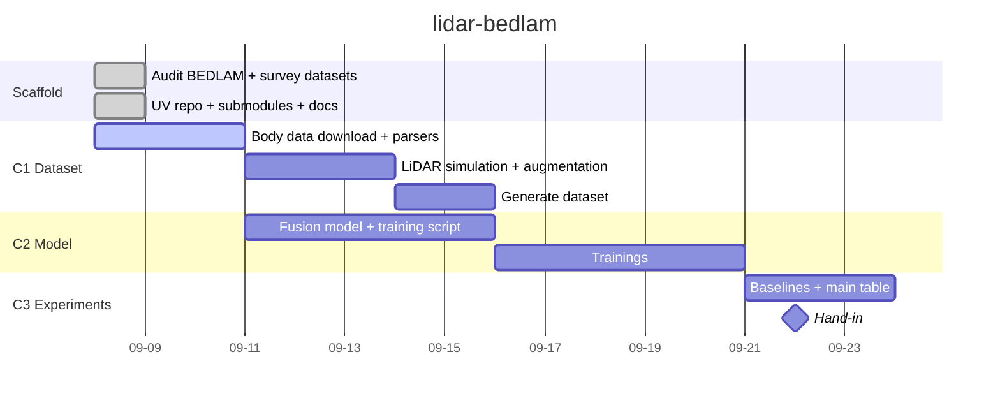

# Progress — lidar-bedlam

The daily log lives in [PROJECT.md](../PROJECT.md). This file only keeps the
Gantt.

## Gantt

```mermaid
gantt
    title lidar-bedlam
    dateFormat  YYYY-MM-DD
    axisFormat  %m-%d
    section Scaffold
    Audit BEDLAM + survey datasets     :done, s1, 2026-09-08, 1d
    UV repo + submodules + docs        :done, s2, 2026-09-08, 1d
    section C1 Dataset
    Body data download + parsers       :active, c1, 2026-09-08, 3d
    LiDAR simulation + augmentation    :c2, after c1, 3d
    Generate dataset                   :c3, after c2, 2d
    section C2 Model
    Fusion model + training script     :m1, after c1, 5d
    Trainings                          :m2, after c3, 5d
    section C3 Experiments
    Baselines + main table             :e1, after m2, 3d
    Hand-in                            :milestone, 2026-09-22, 0d
```
